<div align="center">


# 耳から日本語 · Mimikara Nihongo

### Learn Japanese by ear, from the anime and audiobooks you actually watch and listen to.

[**Features**](#-features) · [**Quick start**](#-quick-start) · [**Setup guide**](#-setup-guide) · [**Anki**](#6-set-up-anki) · [**FAQ**](#-faq)

<br>

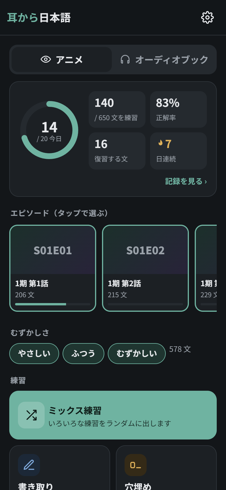&nbsp;&nbsp;
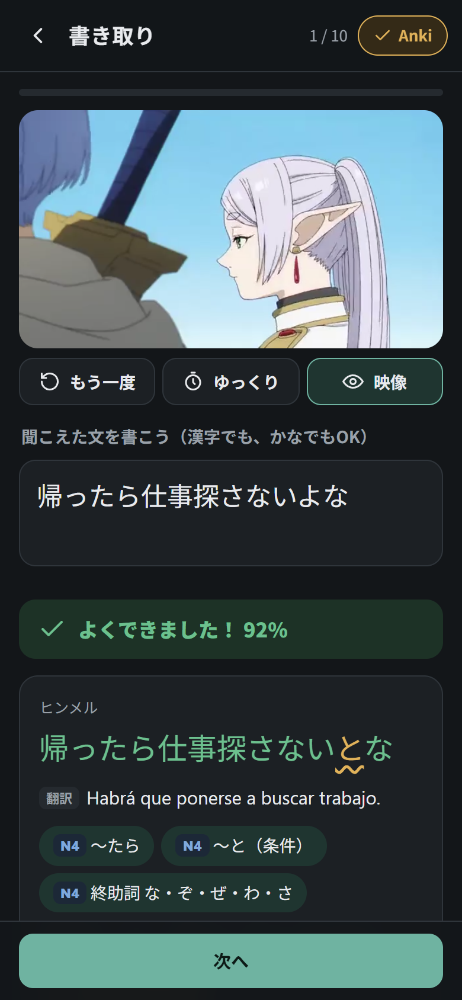&nbsp;&nbsp;
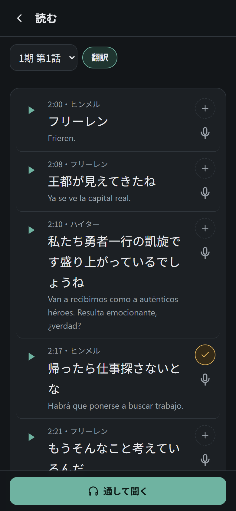

</div>

<br>

Mimikara Nihongo ("Japanese from your ears") turns **your own anime episodes and Japanese audiobooks** into bite-sized listening practice.

A Python script on your PC cuts every subtitle line into its own clip, analyses the sentence (words, readings, meanings, JLPT grammar, difficulty) and packs each episode into a `.zip`. The web app on your phone imports those packs and turns them into drills with spaced repetition, a reader, a vocabulary list, word flashcards, progress charts and one-tap Anki cards.

> [!NOTE]
> Everything runs in the browser and is stored on your phone. It works offline, and there is no account or server. The app's interface is in Japanese, for immersion; this README gives the English meaning of every button you need.

## ✨ Features at a glance

| | Feature | What it does |
|:---:|---|---|
| 🎧 | **Real clips** | Every sentence plays its own clip from the episode, with replay, 75 % speed and audio-only mode. |
| ✍️ | **6 drills** | Dictation, fill in the blank, sentence order, listening, grammar and shadowing, plus a mixed mode. |
| 🎤 | **Shadowing scores** | Record yourself and get scores for intonation (pitch curve), rhythm and pronunciation. |
| 🔁 | **Spaced repetition** | Mistakes come back in 10 minutes; correct answers come back later and later, up to 120 days. |
| 🃏 | **Word cards** | Vocabulary flashcards made from your episodes, each with a real example line and its clip. |
| 📖 | **Reader** | The whole episode line by line, with translation, speaker and optional furigana. |
| 📚 | **Dictionary and grammar** | Tap any word for its meaning (JMdict); 560 JLPT grammar patterns from N5 to N1 with examples. |
| 📊 | **Progress** | Daily goal, streaks, a 30-day chart and accuracy for each drill. |
| 🗂️ | **Anki** | Turn any line into an Anki card with its video, via `.apkg` or straight into AnkiDroid. |
| 📕 | **Audiobooks** | Japanese audiobooks become the same drills, plus whole-chapter listening with a live transcript, paragraph listening and a reader. |
| 💾 | **Backup** | Save and restore your progress as a small file. |

---

## 📑 Contents

- [✨ Features](#-features)
  - [Home screen](#home-screen) · [Episodes and importing](#episodes-and-importing)
  - [Practice drills](#practice-drills-練習): [Mixed](#mixed-practice-ミックス練習) · [Dictation](#dictation-書き取り) · [Fill in the blank](#fill-in-the-blank-穴埋め) · [Order](#sentence-order-並べ替え) · [Listening](#listening-聞き取り) · [Grammar](#grammar-文法) · [Shadowing](#shadowing-シャドーイング) · [Word cards](#word-cards-単語カード) · [Summary](#round-summary-結果)
  - [Learning tools](#learning-tools-学ぶ): [Reader](#reader-読む) · [Furigana](#furigana) · [Word details](#word-details) · [Grammar details](#grammar-details) · [Vocabulary](#vocabulary-単語帳) · [Grammar list](#grammar-list-文法リスト)
  - [Progress](#progress-記録) · [Anki](#anki) · [Settings](#settings-設定)
  - [Audiobooks](#audiobooks-オーディオブック): [Audiobook tab](#audiobook-tab) · [Chapter listening](#chapter-listening-章リスニング) · [Paragraph listening](#paragraph-listening-段落リスニング) · [Chapter reader](#chapter-reader-読む)
- [🚀 Quick start](#-quick-start)
- [🔧 Setup guide](#-setup-guide)
  - [1. Install the PC tools](#1-install-the-pc-tools)
  - [2. Create episode packs (.zip)](#2-create-episode-packs-zip)
  - [3. Create audiobook packs (optional)](#3-create-audiobook-packs-optional)
  - [4. Open the app on your phone](#4-open-the-app-on-your-phone)
  - [5. Import the packs](#5-import-the-packs)
  - [6. Set up Anki](#6-set-up-anki)
  - [7. Back up your progress](#7-back-up-your-progress)
- [❓ FAQ](#-faq)
- [🧩 Customising the grammar list](#-customising-the-grammar-list)
- [📁 Project structure](#-project-structure)
- [🔒 Privacy and copyright](#-privacy-and-copyright)
- [🙏 Credits](#-credits)

---

## ✨ Features

### Home screen

<p align="center">
  &nbsp;&nbsp;
  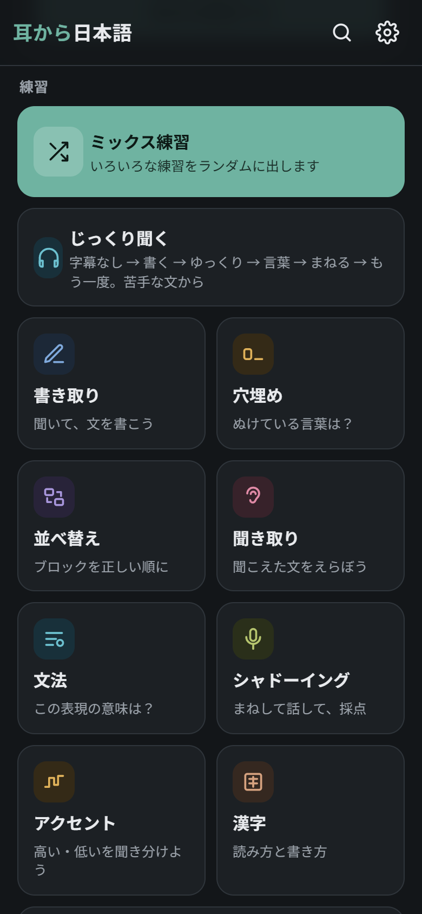
</p>

- **Anime / Audiobook tabs** (アニメ / オーディオブック). Each tab has its own episodes, drills and stats.
- **Today's progress.** A ring shows today's answers against your daily goal, next to the number of sentences practised, your accuracy, the sentences due for review and your day streak (日連続). Tap the card to open the [progress screen](#progress-記録).
- **Difficulty filter** (むずかしさ: easy / normal / hard). The script gives each sentence a difficulty level. The number on the right is how many sentences match your filters.
- **Practice** (練習) and **Learn** (学ぶ) open the drills and tools described below.

### Episodes and importing

<p align="center">
  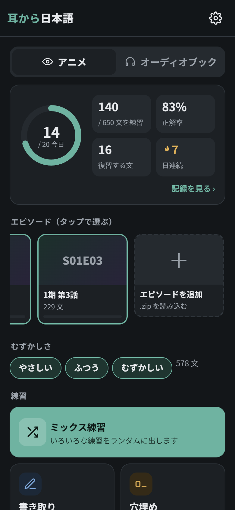
</p>

- Each episode card shows a frame from the episode, the number of sentences and how much you have practised.
- Tap an episode to include or exclude it from the drills; excluded episodes are dimmed.
- The last card, **＋ エピソードを追加** ("add episode"), imports new `.zip` packs, and you can pick several at once. See [Import the packs](#5-import-the-packs).

### Practice drills (練習)

Every drill plays the real clip of the line. You can replay it (もう一度), slow it down to 75 % (ゆっくり), or hide the video and keep only the audio (映像). Each round has 5, 10 or 20 questions.

After each answer the full line is shown, with the speaker, the translation, the grammar patterns and their JLPT level. Tap any word to see its meaning, and any grammar chip for an explanation.

> [!TIP]
> **＋ Anki** in the top-right corner of every drill saves the current line for Anki, even before you answer.

> [!NOTE]
> **Spaced repetition.** Sentences and words you get right come back later and later, up to 120 days. Mistakes come back after 10 minutes. Sentences that are due, or that you often get wrong, are picked more often.

#### Mixed practice (ミックス練習)

A random mix of the sentence drills below (everything except word cards), weighted towards dictation and grammar. It is the big button at the top of 練習.

#### Dictation (書き取り)

<p align="center">
  
</p>

Listen and type the line in kanji or kana, either is accepted. You get a score, and each word is coloured green (right), orange (close) or red (wrong). There are three hints (ヒント): the length and first kana, then a ○○○ outline of the sentence, then the translation.

#### Fill in the blank (穴埋め)

<p align="center">
  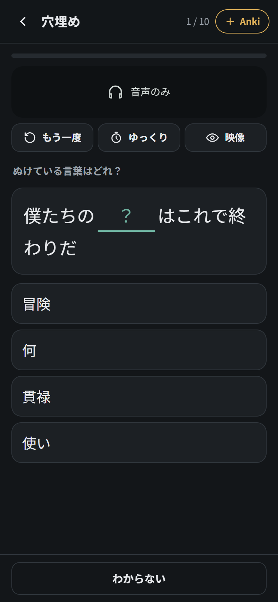
</p>

One content word is missing; pick it from four options. Words you have not marked as known come up first.

#### Sentence order (並べ替え)

<p align="center">
  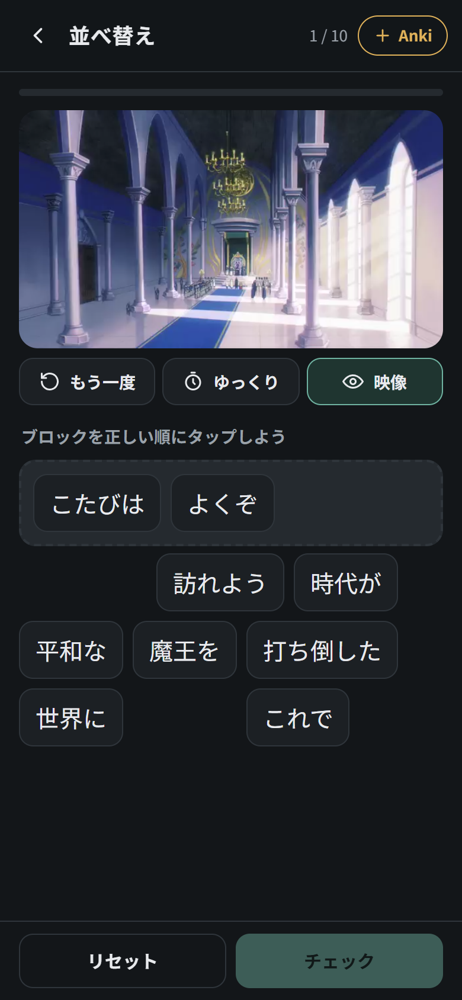
</p>

Tap the phrase blocks in the right order. Tap a block in the answer to put it back, or **リセット** to start again.

#### Listening (聞き取り)

<p align="center">
  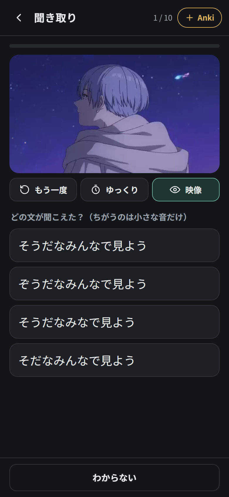
</p>

Choose which of four sentences you heard. The wrong options are sentences of a similar length, so you have to really listen.

#### Grammar (文法)

<p align="center">
  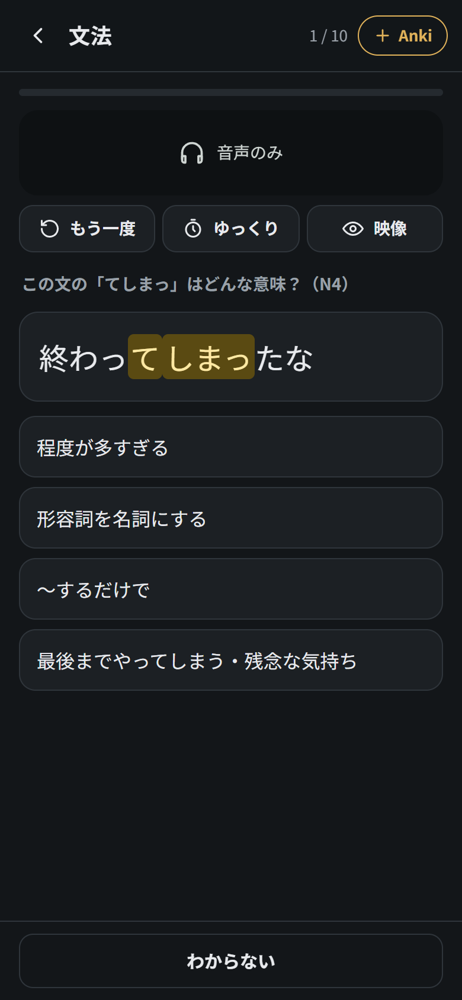&nbsp;&nbsp;
  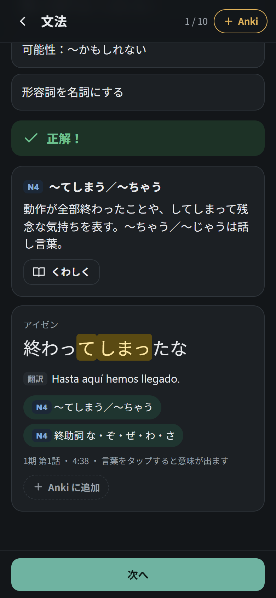
</p>

A grammar pattern is highlighted in the line; choose what it means. After answering you get a short explanation, and **くわしく** opens the full grammar page. Only the JLPT levels enabled in Settings are asked.

#### Shadowing (シャドーイング)

<p align="center">
  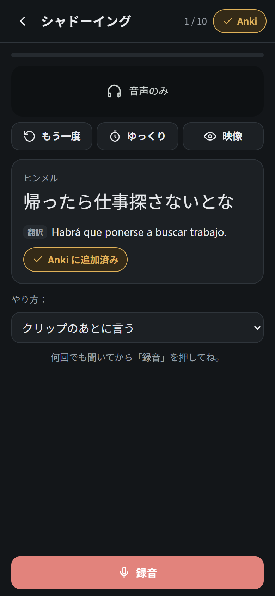
</p>

Record yourself repeating the line, either after the clip (クリップのあとに言う) or together with it (クリップといっしょに言う, earphones recommended). You get scores for **intonation** (your pitch curve against the character's), **rhythm** and **pronunciation**.

> [!IMPORTANT]
> The microphone only works when the app is opened over HTTPS (or on `localhost`). The pronunciation score uses the browser's speech recognition, so it also needs an internet connection.

#### Word cards (単語カード)

<p align="center">
  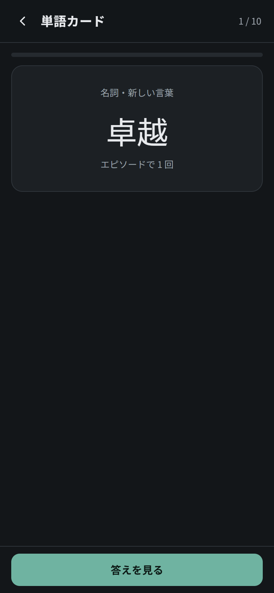&nbsp;&nbsp;
  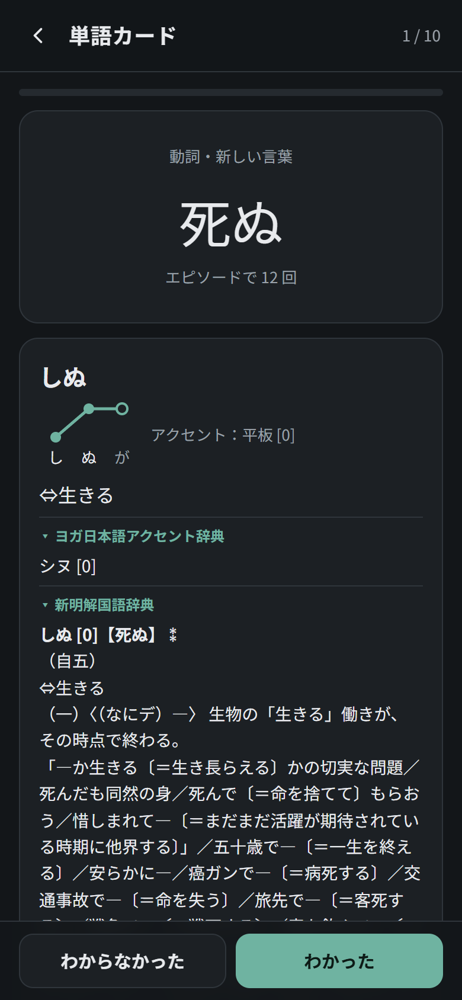
</p>

Vocabulary flashcards made from the words in your episodes, most frequent first. See the word, tap **答えを見る** to reveal the reading, meanings and a real line from the anime where it appears (with its clip), then choose *knew it* (わかった) or *didn't* (わからなかった). **✓ 覚えた** marks the word as known so it never comes back. The home screen shows how many words are due today.

#### Round summary (結果)

<p align="center">
  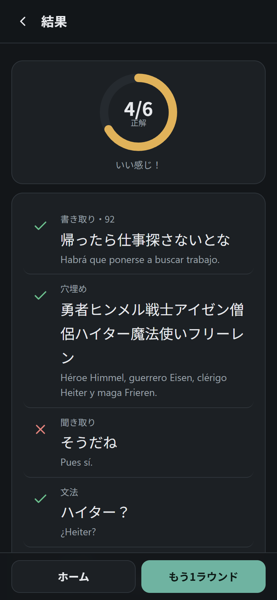
</p>

At the end of each round: your score and every line you practised, with ✓, ✗ or ― (close). **もう1ラウンド** starts another round.

### Learning tools (学ぶ)

#### Reader (読む)

<p align="center">
  
</p>

The whole episode line by line, with timestamps and speakers. Play any line, listen to the whole episode continuously (通して聞く), show or hide the translation (翻訳), send a line to Anki (＋) or shadow it (🎤).

#### Furigana

<p align="center">
  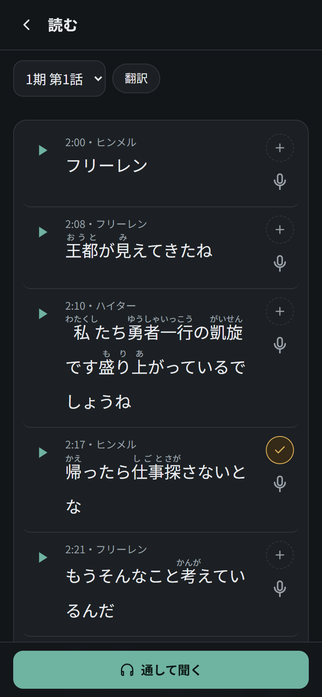
</p>

Optional, and off by default. When turned on in Settings (ふりがなを表示する), readings appear above the kanji in every sentence in the app.

#### Word details

<p align="center">
  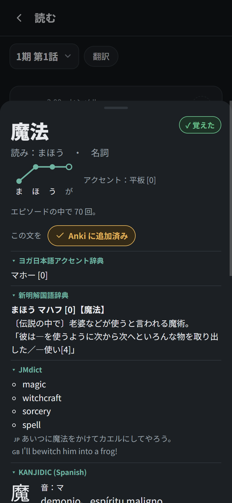
</p>

Tap any word anywhere in the app to see its dictionary form, reading, part of speech, meanings (JMdict, in English), how often it appears, and example lines with audio. **覚えた？** marks it as known.

#### Grammar details

<p align="center">
  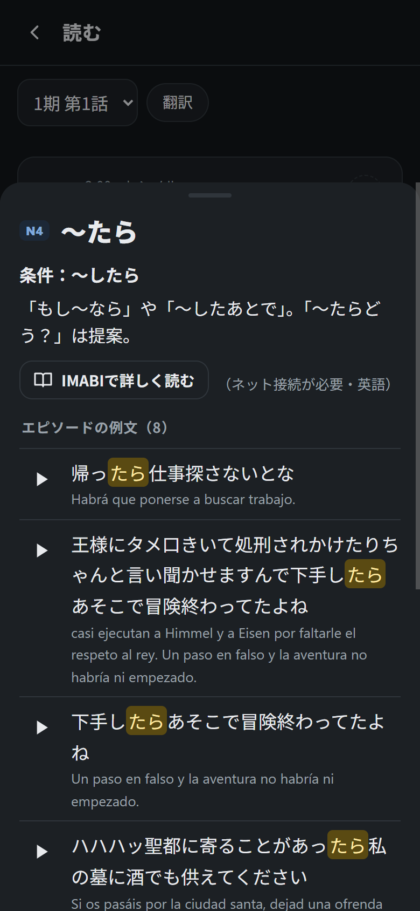
</p>

Each pattern has its JLPT level, a short explanation, a link to [IMABI](https://imabi.org/) for a full lesson (in English) and every line in your episodes that uses it.

#### Vocabulary (単語帳)

<p align="center">
  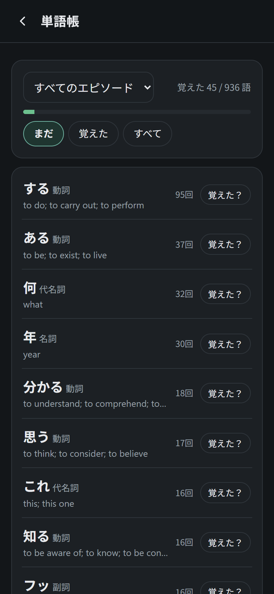
</p>

Every word from your episodes, most frequent first, filtered by episode and by *not yet* (まだ), *known* (覚えた) or *all* (すべて), with a progress bar of known words.

#### Grammar list (文法リスト)

<p align="center">
  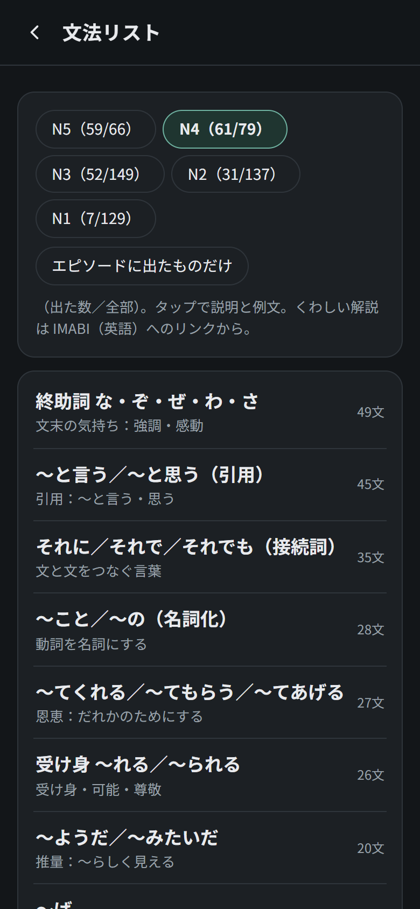
</p>

560 patterns from N5 to N1. For each level it shows how many appear in your episodes, and it can be filtered to those that appear (エピソードに出たものだけ).

### Progress (記録)

<p align="center">
  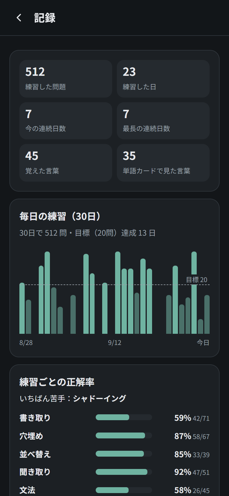&nbsp;&nbsp;
  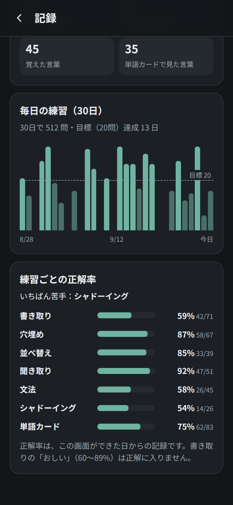
</p>

Open it by tapping the progress card on the home screen (記録を見る).

- **Totals:** questions answered, days practised, current streak, best streak, known words and words seen in word cards.
- **Last 30 days:** one bar per day with your daily goal as a dashed line. Bars that reach the goal are highlighted, and tapping a bar shows that day's count.
- **Accuracy by drill,** with your weakest drill called out.

### Anki

<p align="center">
  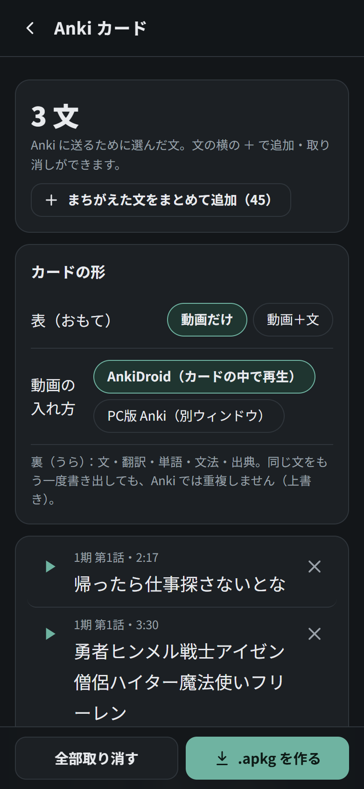&nbsp;&nbsp;
  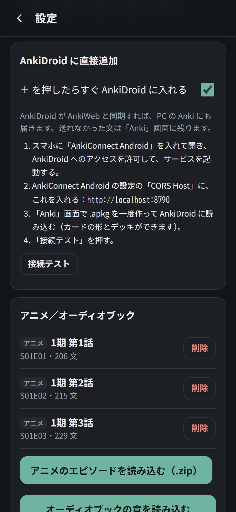
</p>

Any line can become an Anki card, with the clip on the front and the sentence, translation, word meanings, grammar and source on the back. There are two ways to get cards into Anki:

1. **Export an `.apkg`** from the Anki screen (Anki カード). Choose whether the front shows the video alone or the video plus the sentence, and whether the video plays inside the card (AnkiDroid) or in a separate window (desktop Anki). **＋ まちがえた文をまとめて追加** adds every line you have got wrong in one go.
2. **Send cards directly to AnkiDroid** when you tap ＋, with no files involved. AnkiDroid then syncs them to AnkiWeb and desktop Anki.

Step-by-step instructions for both are in [Set up Anki](#6-set-up-anki).

### Settings (設定)

<p align="center">
  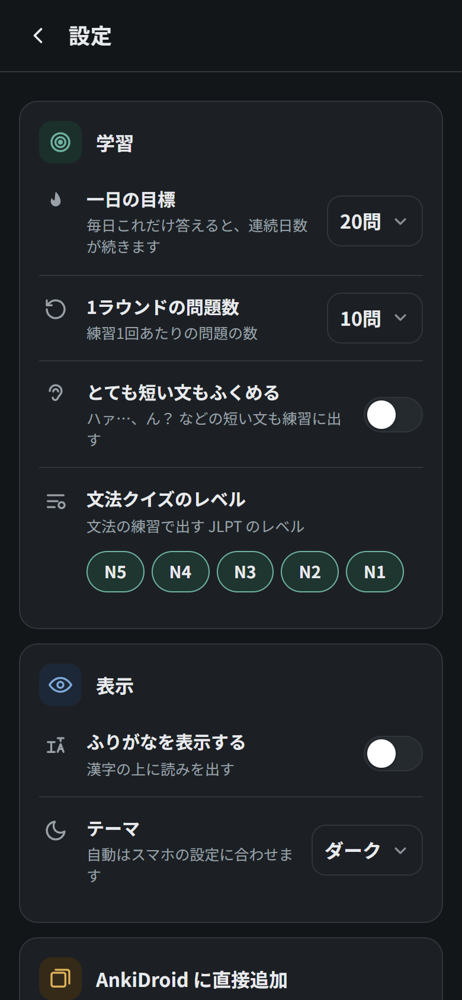&nbsp;&nbsp;
  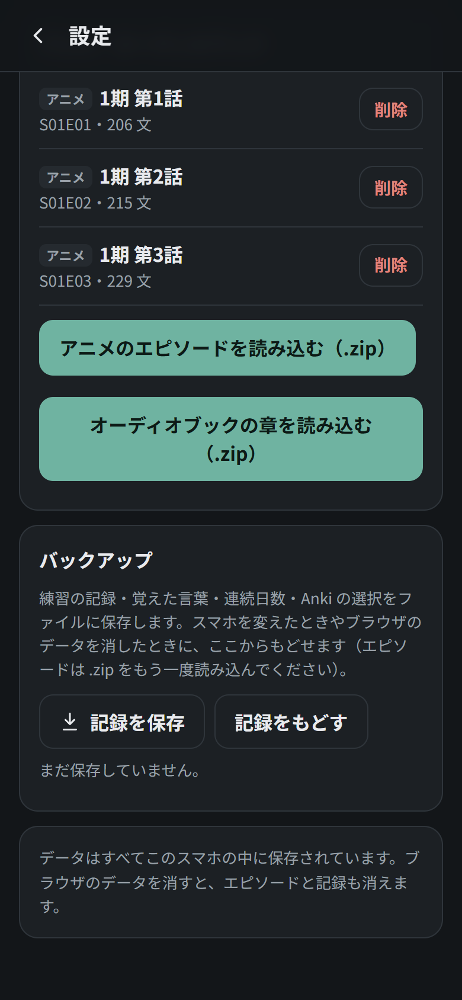
</p>

Open it with the ⚙ button on the home screen.

| Setting | Meaning |
|---|---|
| 一日の目標 | Daily goal: 10, 20, 30 or 50 questions. |
| 1ラウンドの問題数 | Questions per round: 5, 10 or 20. |
| ふりがなを表示する | Show furigana. |
| とても短い文もふくめる | Include very short lines such as ハァ… or ん？. |
| テーマ | Theme: auto, light or dark. |
| 文法クイズのレベル | JLPT levels used in the grammar drill. |
| AnkiDroid に直接追加 | Send cards straight to AnkiDroid. |
| アニメ／オーディオブック | Your imported episodes and chapters, with **削除** to delete them and buttons to import more. |
| バックアップ | Save or restore your progress. See [Back up your progress](#7-back-up-your-progress). |

### Audiobooks (オーディオブック)

#### Audiobook tab

<p align="center">
  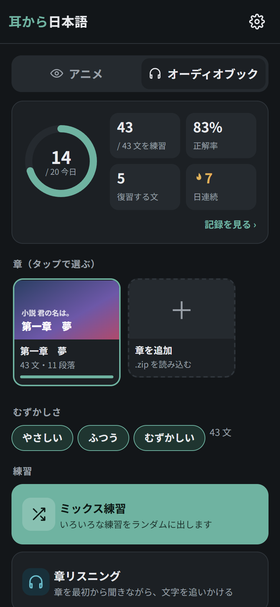
</p>

The オーディオブック tab works like the anime one, but with audio clips cut from a narrated book. Each chapter (章) has its own card with the book title, and the script also splits every chapter into paragraphs (段落) using the narrator's pauses. All the drills work here too; the wide button under them, **章リスニング**, plays the whole chapter with a live transcript. How to create the packs is explained in [Create audiobook packs](#3-create-audiobook-packs-optional).

#### Chapter listening (章リスニング)

<p align="center">
  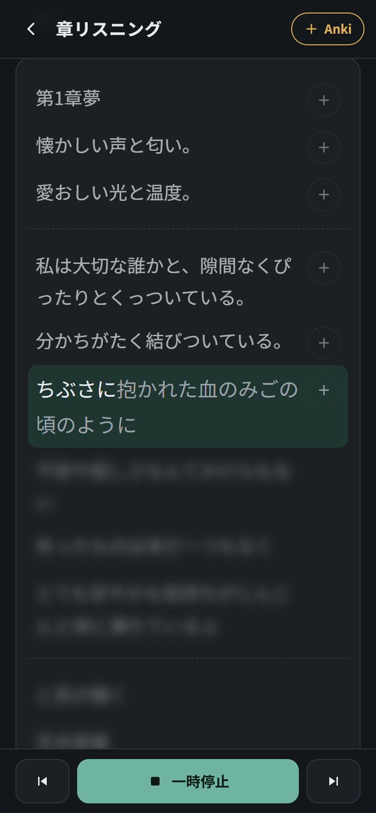
</p>

Listen to the **whole chapter** while the transcript follows along, like live subtitles. The sentence being read is highlighted and fills in word by word as the narrator speaks; sentences already heard stay readable, and the ones still to come are blurred so you listen before you read (**先の文も表示** shows them). The page scrolls along on its own, pausing for a few seconds if you scroll yourself.

- **⏮ ⏯ ⏭** go to the previous sentence, pause or resume, and go to the next sentence. Tap any sentence to jump to it, or the time bar to jump to that point of the chapter.
- **＋ Anki** in the top-right corner always adds the sentence being read; the small ＋ next to each sentence adds that one.
- Tap any word for its meaning. **ゆっくり** slows the audio down.
- It remembers where you stopped in each chapter, and at the end of a chapter it moves on to the next one if you have imported it.

#### Paragraph listening (段落リスニング)

<p align="center">
  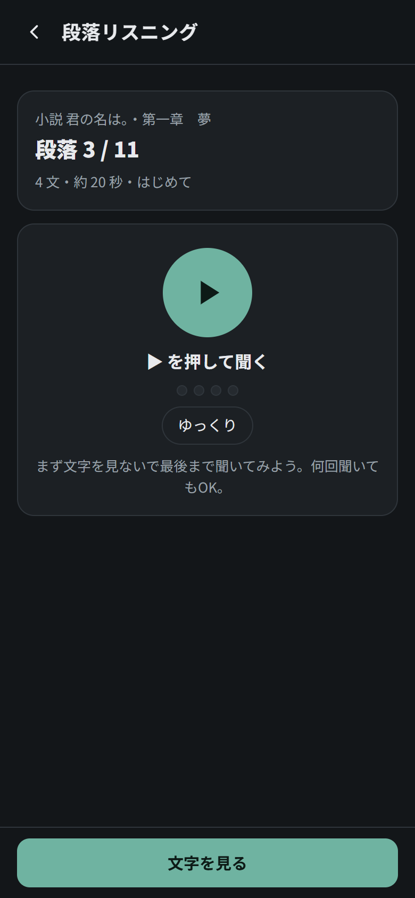&nbsp;&nbsp;
  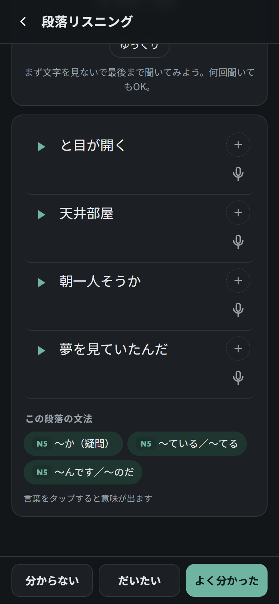
</p>

Open it with **練習** next to any paragraph in the chapter reader. Listen to that paragraph **without seeing the text**, as many times as you like; the dots show which sentence is playing. Then tap **文字を見る** to reveal it: every sentence can be replayed, sent to Anki or shadowed, and the paragraph's grammar patterns are listed underneath. Finally rate how much you understood (**分からない** / **だいたい** / **よく分かった**), which feeds the spaced repetition.

#### Chapter reader (読む)

<p align="center">
  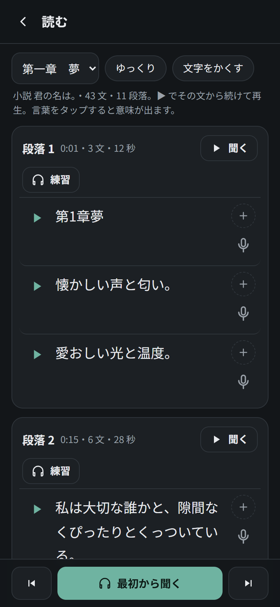
</p>

The whole chapter, grouped by paragraph. **最初から聞く** plays the chapter from start to finish, sentence by sentence: the current sentence is highlighted and the page scrolls along with it. Tap any sentence to continue from there, step back or forward one sentence with ⏮ ⏭, listen to a single paragraph (聞く) or practise it (練習). **文字をかくす** hides the text so you can listen first, and **ゆっくり** slows the audio down.

---

## 🚀 Quick start

1. **Install** Python 3.10+ and run `pip install -r script/requirements.txt`.
2. **Create packs** from a folder with your episodes and Japanese subtitles: `python script/run_all.py "E:\Anime\MySeries"`.
3. **Open the app** on your phone, served over HTTPS (GitHub Pages works; see [step 4](#4-open-the-app-on-your-phone)), and add it to your home screen.
4. **Import** the `.zip` files with **＋ エピソードを追加**.
5. **Practise.** Optionally, [connect AnkiDroid](#6-set-up-anki) and [back up](#7-back-up-your-progress) your progress from time to time.

---

## 🔧 Setup guide

```
Your PC                                            Your phone
───────                                            ──────────
anime .mkv/.mp4 + Japanese .srt/.ass ─┐
                                      ├─ script ─▶ .zip packs ─▶ import in the app
audiobook .mp3 (one file / chapter) ──┘  (Python)                (stored on the phone)
```

### 1. Install the PC tools

You need **Python 3.10 or newer**. [Anaconda](https://www.anaconda.com/download) or the regular [python.org](https://www.python.org/downloads/) installer both work. Open a terminal (on Windows, *Anaconda Prompt* or *Command Prompt*) and run:

```bash
cd "C:\path\to\mimikara-nihongo\script"
pip install -r requirements.txt
```

<details>
<summary><b>What gets installed</b></summary>

<br>

| Package | Used for |
|---|---|
| `fugashi` + `unidic-lite` | Splitting Japanese into words, with readings |
| `pysubs2` | Reading `.srt` / `.ass` subtitles |
| `numpy` | Aligning the subtitles with the audio |
| `imageio-ffmpeg` | A bundled `ffmpeg` for cutting clips. If `ffmpeg` is already on your PATH, that one is used instead. |
| `faster-whisper` | Transcribing audiobooks. Only needed for audiobooks. |

</details>

The dictionary, `jmdict_min.zip`, is included and is unpacked automatically the first time you run the script.

### 2. Create episode packs (.zip)

**a) Put each series in one folder.** For every episode you need the video (`.mkv` or `.mp4`) and a **Japanese subtitle file** (`.srt` or `.ass`). Subfolders are fine.

```
E:\Anime\Frieren\
├── Frieren S01E01.mkv
├── Frieren S01E01.ja.srt
├── Frieren S01E02.mkv
├── Frieren S01E02.ja.srt
└── ...
```

> [!WARNING]
> **File naming matters.**
> - Every file name must contain the season and episode, as `S01E05` or `S1 - 05`. That is how a video is matched with its subtitle. Files without it are ignored.
> - Subtitle files whose name contains `.en.`, `.eng.`, `.es.` or `.spa.` are treated as non-Japanese and skipped. Any other `.srt`/`.ass` with an episode code is taken as the Japanese subtitle, so keep other languages out of the folder or name them that way.
> - Keep one Japanese subtitle per episode. If there are two, only one is used.

**The translation** shown in the app comes from the subtitle tracks **inside** the `.mkv`: Spanish if there is one, otherwise English, which the app labels 翻訳（英語）. With neither, the episode has no translation.

**b) Run the script** on the series folder:

```bash
python run_all.py "E:\Anime\Frieren"
```

The packs are written to `<project>\paquetes\anime\<series folder name>\S01E01.zip`, and so on. Each episode takes a few minutes and ends up around 20 MB. If you stop the script and run it again, episodes that already have a `.zip` are skipped. Before starting, it lists the videos it found without a Japanese subtitle.

<details>
<summary><b>Options</b></summary>

<br>

| Option | Effect |
|---|---|
| `--solo S01E01 S01E02` | Only process these episodes. |
| `--salida "D:\packs"` | Write the packs somewhere else. |
| `--rehacer` | Rebuild episodes that already have a `.zip`, for example after updating the script. |
| `--no-unir` | Don't merge consecutive subtitle lines from the same speaker into one sentence. |

</details>

<details>
<summary><b>What the script does with each episode</b></summary>

<br>

1. Cleans the Japanese subtitles: removes speaker names in brackets, song lyrics and sound effects.
2. Merges consecutive lines spoken by the same character into one sentence and one clip. The speaker comes from the name in brackets in the Japanese subtitle, or from the *Actor* field of the embedded subtitles.
3. Measures the offset between the subtitles and the audio, and corrects it.
4. Splits each sentence into words with readings and furigana, looks up meanings in JMdict, and detects JLPT grammar patterns.
5. Rates each sentence as easy, normal or hard.
6. Cuts a 360p clip (H.264 + AAC) for every sentence.

</details>

### 3. Create audiobook packs (optional)

Put the book in a folder with **one audio file per chapter** (`.mp3`, `.m4b`, `.m4a`, `.aac`, `.flac`, `.wav`, `.ogg` or `.opus`). Chapter numbers are read from names like `Book title - 03 - Chapter name.mp3`, or from any number in the file name.

```bash
python audiobook.py "C:\Audiobooks\MyBook\mp3"
```

- Each chapter is transcribed with Whisper. The first run downloads the model, about 1.5 GB.
- The text is split into sentences and into paragraphs (段落) using the narrator's pauses, and then analysed like the anime.
- One `.zip` per chapter is written to `<project>\paquetes\audiolibros\<book title>\`.
- Transcriptions are cached in a `_transcripciones` folder, so `--rehacer` never transcribes again.

> [!TIP]
> Try the shortest chapter first (`--solo 2`) to see how long it takes. On a CPU, `large-v3-turbo` runs at roughly 1× to 3× the length of the audio.

<details>
<summary><b>Options</b></summary>

<br>

| Option | Effect |
|---|---|
| `--solo 2 3` | Only these chapters. |
| `--modelo small` | Much faster, less accurate. The default is `large-v3-turbo`. |
| `--dispositivo cuda` | Use an NVIDIA GPU instead of the CPU. |
| `--id BOOK1` | Short ID for the book. By default it is taken from the name. |
| `--salida "D:\packs"` | Write the packs somewhere else. |
| `--rehacer` | Rebuild the packs using the saved transcriptions. |

</details>

### 4. Open the app on your phone

The app in the `app/` folder is a set of static files with no build step.

> [!IMPORTANT]
> Serve it over **HTTPS**. The microphone (shadowing), offline mode and "Add to Home screen" only work on HTTPS.

**Option A: GitHub Pages (recommended)**

1. On GitHub, open the repository, go to **Settings → Pages**, and under *Build and deployment* choose **Deploy from a branch → `main` → `/ (root)`**.
2. After a minute the app is live at `https://<your-user>.github.io/<repo-name>/app/`.
3. Open that address in Chrome on your phone, then use **⋮ → Add to Home screen** to install it like a normal app.

GitHub Pages is free for public repositories. For a private repository it needs a paid GitHub plan. Making the repository public is safe, because the packs in `paquetes/` are never uploaded (see [Privacy and copyright](#-privacy-and-copyright)).

**Option B: another static host.** Netlify, Cloudflare Pages, Vercel and similar hosts all work. Publish the `app/` folder.

**Option C: from your PC, for testing.**

```bash
cd app
python -m http.server 8000
```

On the PC, open `http://localhost:8000` and everything works, including the microphone. From the phone on the same Wi-Fi, `http://<your-PC-IP>:8000` works too, but without the microphone or offline install, because it is not HTTPS.

### 5. Import the packs

1. Copy the `.zip` files to your phone, using a USB cable, Google Drive or anything else. Each anime episode is about 20 MB.
2. In the app, tap **＋ エピソードを追加** at the end of the episode shelf, or go to **⚙ 設定 → アニメのエピソードを読み込む（.zip）**. For audiobooks, use the オーディオブック tab or **オーディオブックの章を読み込む（.zip）**.
3. Select one or more `.zip` files. The clips are copied into the app's storage, so the `.zip` files can be deleted afterwards.

To remove an episode, go to **⚙ 設定 → アニメ／オーディオブック → 削除**. This deletes its sentences and clips.

### 6. Set up Anki

#### Option 1: `.apkg` files (simplest)

1. In any drill, the reader or a word's example lines, tap **＋ Anki** on the lines you want.
2. Open **Anki** from the home screen (学ぶ → Anki).
3. Choose the card layout, then tap **.apkg を作る** ("create .apkg").
4. On Android the share menu opens: choose **AnkiDroid**. On a PC the file is downloaded; double-click it to import it into Anki.

Re-exporting the same line updates the existing card instead of creating a duplicate. The deck is called `耳から日本語::アニメ` (or `…::オーディオブック`).

#### Option 2: straight into AnkiDroid when you tap ＋

This uses [AnkiConnect Android](https://github.com/KamWithK/AnkiconnectAndroid), a free companion app that lets other apps on the phone add cards to AnkiDroid.

1. Install **[AnkiDroid](https://play.google.com/store/apps/details?id=com.ichi2.anki)**, and install **AnkiConnect Android** from its [GitHub releases](https://github.com/KamWithK/AnkiconnectAndroid/releases).
2. Open AnkiConnect Android, allow it to access AnkiDroid, and start the service.
3. In Mimikara Nihongo, go to **⚙ 設定 → AnkiDroid に直接追加** and turn the switch on. The instructions that appear show **your app's address**, for example `https://your-user.github.io`.
4. In AnkiConnect Android's settings, paste that address into **CORS Host**. Without it, the phone's browser blocks the connection.
5. Import **one** `.apkg` from Option 1 into AnkiDroid. This creates the card type and the deck, which AnkiConnect Android cannot create by itself.
6. Tap **接続テスト** ("connection test"). When you see ✓, every ＋ goes straight into AnkiDroid.

> [!TIP]
> If Chrome asks whether the page may access devices on your local network, allow it. If Android keeps closing AnkiConnect Android, turn off battery optimisation for it. Cards that cannot be sent stay in the Anki screen, with a **AnkiDroid に直接送る** button to send everything pending later.

### 7. Back up your progress

> [!CAUTION]
> Progress lives in the phone's browser storage. **Clearing the browser data or changing phones erases it.** Make a backup now and then.

- **⚙ 設定 → バックアップ → 記録を保存** saves a small `mimikara_backup_<date>.json` file, and on a phone the share menu opens so you can send it to Drive, email and so on. The backup includes sentence and word progress, known words, streaks, Anki selections and settings.
- **記録をもどす** restores a backup, asking for confirmation first.
- Clips are **not** included. Re-import the episode `.zip` files after restoring.

---

## ❓ FAQ

<details>
<summary><b>Some episodes were skipped by the script.</b></summary>

<br>

The script prints the videos it could not match with a Japanese subtitle. Check that both files contain the episode code (`S01E05` or `S1 - 05`) and that the Japanese subtitle's name does not contain `.en.`, `.eng.`, `.es.` or `.spa.`.

</details>

<details>
<summary><b><code>OMP: Error #15</code> when processing an audiobook.</b></summary>

<br>

This happens with Anaconda, whose `numpy` and faster-whisper each ship their own copy of the OpenMP runtime. `audiobook.py` already sets `KMP_DUPLICATE_LIB_OK=TRUE` to allow it; if you still see the error with an old copy of the script, run `set KMP_DUPLICATE_LIB_OK=TRUE` in the same terminal first.

</details>

<details>
<summary><b>The episode has no translation.</b></summary>

<br>

Translations are read from the subtitle tracks embedded in the `.mkv` (Spanish first, then English). If the video has neither, the episode is imported without a translation.

</details>

<details>
<summary><b>Shadowing says the microphone is not available.</b></summary>

<br>

Open the app over HTTPS (for example GitHub Pages) or on `localhost`, and allow microphone access when the browser asks.

</details>

<details>
<summary><b>The video has no sound in AnkiDroid.</b></summary>

<br>

On the Anki screen, set **動画の入れ方** to **PC版 Anki（別ウィンドウ）** and export again. AnkiDroid then plays the clip in its own player.

</details>

<details>
<summary><b>The connection test to AnkiDroid fails.</b></summary>

<br>

Make sure AnkiConnect Android's service is running, that its **CORS Host** is exactly the address shown in the app's settings, and that you have imported one `.apkg` so the deck and card type exist.

</details>

<details>
<summary><b>I changed phones. How do I keep my progress?</b></summary>

<br>

On the old phone use **記録を保存**, then on the new phone import your episode `.zip` files and use **記録をもどす** with the backup file.

</details>

---

## 🧩 Customising the grammar list

All grammar patterns are defined in `script/grammar_jlpt.py`, with the level, a Japanese explanation, a detection pattern and an IMABI link for each. After editing it:

```bash
cd script
python export_grammar.py "../app/grammar_ja.js"
```

Then rebuild your packs with `--rehacer` so the new patterns are detected in the episodes.

## 📁 Project structure

```
.
├── app/                    The web app (plain HTML/CSS/JS, no build step)
│   ├── index.html
│   ├── app.js              Screens, drills, spaced repetition, stats, backup, AnkiConnect
│   ├── app.css
│   ├── audio.js            Pitch/rhythm analysis for shadowing, answer alignment for dictation
│   ├── anki.js             Builds .apkg files in the browser (sql.js)
│   ├── grammar_ja.js       JLPT grammar list (generated)
│   ├── sw.js               Service worker (offline)
│   └── manifest.webmanifest
├── script/                 PC tools (Python)
│   ├── run_all.py          Processes a whole anime folder → one .zip per episode
│   ├── process.py          Processes one episode
│   ├── audiobook.py        Processes an audiobook → one .zip per chapter
│   ├── grammar_jlpt.py     Grammar definitions (N5–N1)
│   ├── export_grammar.py   Regenerates app/grammar_ja.js
│   ├── jmdict_min.zip      Compact JMdict dictionary
│   └── LEEME.txt           Short guide in Spanish
├── docs/screenshots/       Images used in this README
└── paquetes/               Your generated packs (not in the repository)
```

## 🔒 Privacy and copyright

- The app has no backend. Nothing leaves your device, with three exceptions: the optional speech recognition used for the shadowing pronunciation score (the browser's own service), IMABI links when you open them, and AnkiConnect, which stays on the same phone.
- **The repository contains no anime or audiobook content.** `paquetes/` is excluded in `.gitignore`. Only process media you own, and don't publish the generated packs, since they contain copyrighted clips and subtitles.
- The screenshots in this README show a few frames and subtitle lines from *Frieren: Beyond Journey's End* (葬送のフリーレン) purely to illustrate how the app works. They are © their respective owners.

## 🙏 Credits

| | |
|---|---|
| **Dictionary** | [JMdict](https://www.edrdg.org/wiki/index.php/JMdict-EDICT_Dictionary_Project) © Electronic Dictionary Research and Development Group, used under [CC BY-SA 4.0](https://creativecommons.org/licenses/by-sa/4.0/). `script/jmdict_min.zip` is a reduced version. |
| **Morphological analysis** | [fugashi](https://github.com/polm/fugashi) + [UniDic](https://clrd.ninjal.ac.jp/unidic/) |
| **Audiobook transcription** | [faster-whisper](https://github.com/SYSTRAN/faster-whisper) |
| **In the app** | [sql.js](https://github.com/sql-js/sql.js) (building `.apkg` files) and [fflate](https://github.com/101arrowz/fflate) (reading `.zip` files) |
| **Grammar lessons** | Links to [IMABI](https://imabi.org/) |
| **Direct AnkiDroid integration** | [AnkiConnect Android](https://github.com/KamWithK/AnkiconnectAndroid) |

<div align="center">
<br>

**頑張って！** 🎌

</div>
